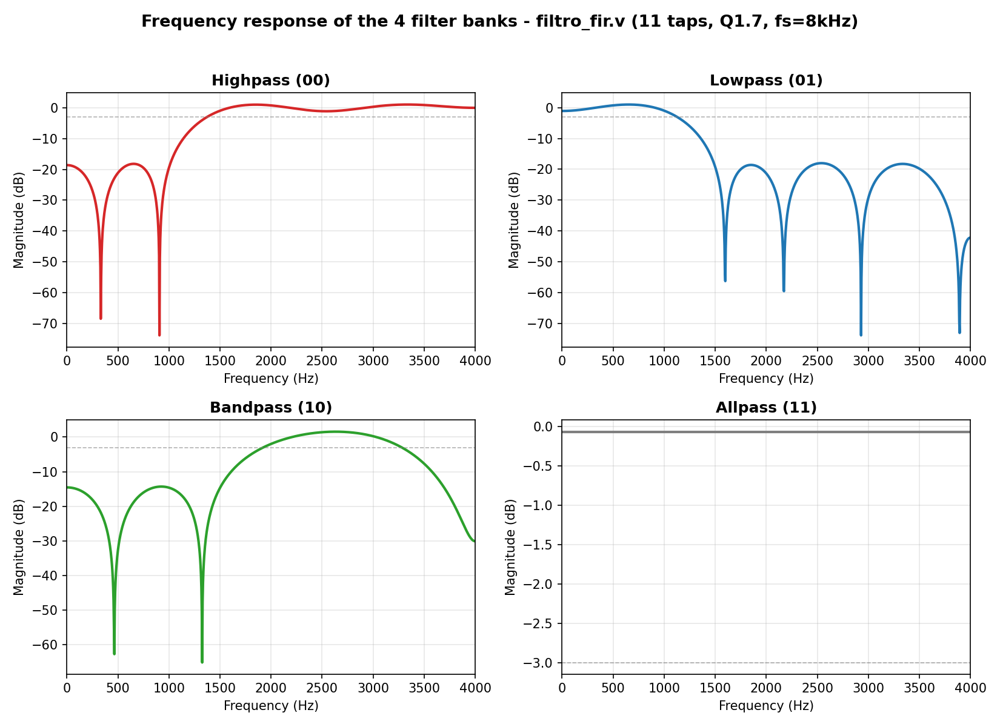

<!---

This file is used to generate your project datasheet. Please fill in the information below and delete any unused
sections.

You can also include images in this folder and reference them in the markdown. Each image must be less than
512 kb in size, and the combined size of all images must be less than 1 MB.
-->

## How it works

This proyects is a FIR(Finite Impulse Response) used us a filtter. In this case use typical fixed point aproach and 11 different cofficients with 4 different types to select().It is design to acept digital audio signal into the (ui_in) with 4kHz bandwith. 
When the signal enter to the system it is proccees by the FIR and sended through the uart_tx.v to get the filltered sigal,
Implement 4 different fillters:
Hight pass 
Low pass
Band pass
All pass 
## Frequency Response

## How to test
To use the proyect you need to define filtter coeficient by seection them with uio[1] and [2] pins. Also the 8bits input signal, into the ui[1] and [2] 

## External hardware
No external hardware needed.
